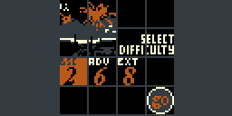
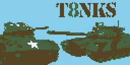
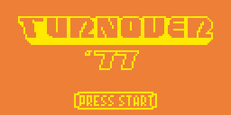
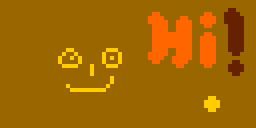
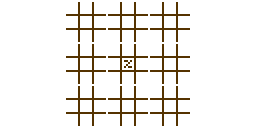

My Chip8 games
==============

Subter8nia
----------

[Play here](http://johnearnest.github.io/Octo/index.html?gist=1e84a95321c330f9448dccef0690da53)

Lander game for superchip. Made as part of Octojam 4.   
Control with **WASD**. Press **R** to reset.

Jub8
----

[Song 1](http://johnearnest.github.io/Octo/index.html?gist=1fafdc5346d720df42806a837878fa87)
[Song 2](http://johnearnest.github.io/Octo/index.html?gist=ded80becf8631daa078f8715219d330f)
[Song 3](http://johnearnest.github.io/Octo/index.html?gist=1ad117a1a8f99b6fc165bd82ac700ba3)
[Song 4](http://johnearnest.github.io/Octo/index.html?gist=7e20d9d6d61b205ab6f486c926794b78)
[Song 5](http://johnearnest.github.io/Octo/index.html?gist=39a70f937451aee84aca02d6d5614fef)
[Song 6](http://johnearnest.github.io/Octo/index.html?gist=d94f7c5476f6fa5649aadfbe863baf7d)

Rhythm game for XO-Chip. Made as part of Octojam 3. Requires high rollover keyboard.    
**Warning**: Very loud and scratchy audio.

T8NKS
-----

[Play Here](http://johnearnest.github.io/Octo/index.html?gist=b5c7cdf6506e55d59011)

Artillery game for XO-Chip. Made as part of Octojam 2.  
Select a weapon with **1 2 3**.
Aim with **WASD**. Shoot with **E**.

Turnover 77
-----------

[Play Here](http://johnearnest.github.io/Octo/index.html?key=pkOhj2BP)

Demake of the game Roundabout. Made as part of Octojam 1.
Control with **WASD**

OctoPaint
-----

[Play here](http://johnearnest.github.io/Octo/index.html?key=ZNiauW2S)

Control Cursor with **WASD**. **V** draws **C** erases. **123** selects brush size. **ZX** selects drawing layers. 

Ultimate Tic-tac-toe
--------------------

[Play here](http://johnearnest.github.io/Octo/index.html?key=bPCYoOoc)

**WASD + E**